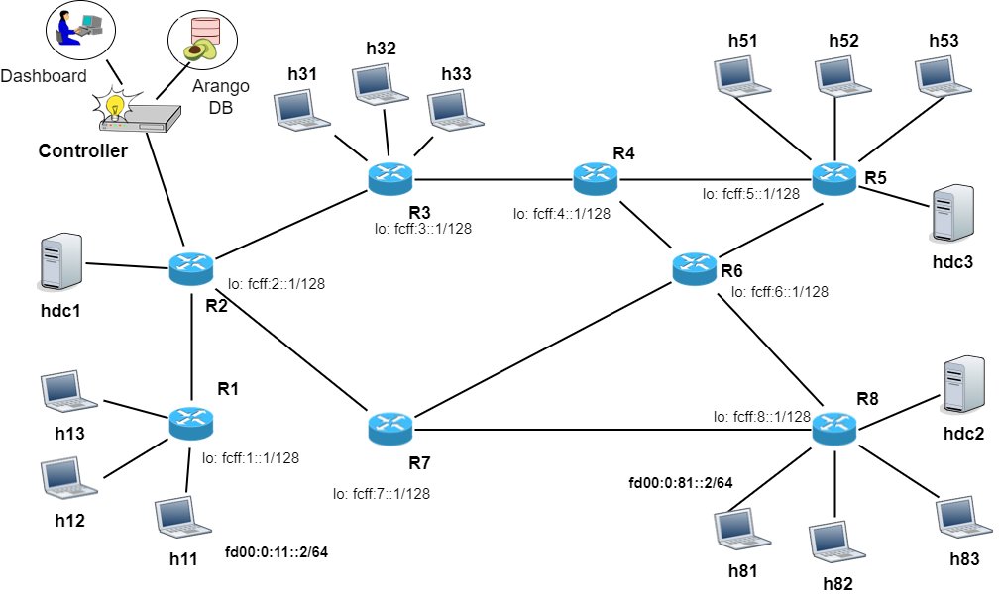

## EIP - Extensible In-band Processing

EIP extends the functionality of IPv6 layer to support the requirements of future Internet services / 6G networks.

In a nutshell, IPv6 nodes can read/write EIP information in packet headers to support different use cases (e.g. advanced monitoring, semantic routing, deterministic networking, slicing... ).

EIP provides a common solution which can be tailored for the different use cases. Each use case will have its own specific architectural aspects and protocol specifications. The following figure shows potential use cases for EIP.

<!---

https://docs.google.com/drawings/d/1ctZaFKg3NlQ3J1ux1yz0nQMAYlKPj_ZzqL-1X3w97SA/edit

REVISED VERSION:
https://docs.google.com/drawings/d/1eJshyo31ii9Qk8Ic8NMQ1ZlNrErw3Y3Z_7Dc4dRsb98/edit

--->

### Scientific papers on EIP

S.Salsano, G.Sidoretti, C.Scarpitta, H.ElBakoury, D. Lopez, L.Bracciale, P.Loreti,
“Supporting Future Internet Services with Extensible In-band Processing (EIP)”,
accepted to 1st ACM SIGCOMM Workshop on Future of Internet Routing & Addressing (FIRA) [download pdf](https://tinyurl.com/eip-paper )

### Presentations on EIP

Find [here](https://tinyurl.com/eip4coinrg) a presentation about EIP. This presentation has been given @IRTF COIN RG interim meeting on Thu 2022-02-10 16.30 CET / 10.30 EST. 

### Special Interest Group on EIP

An informal Special Interest Group is active to discuss EIP use cases, architecture and protocol specifications. A mailing list and a wiki have been setup.

The mailing list address is [eip@cnit.it](mailto:eip@cnit.it). Subscribe to the mailing list and access the list archives [here](http://postino.cnit.it/cgi-bin/mailman/listinfo/eip).

The wiki is available [here](https://github.com/eip-home/eip/wiki)

### EIP documentation 

Work in progress: EIP use cases, architecture, protocol specifications.

The status of the work is available [here](https://github.com/eip-home/eip/wiki/EIP-documentation)

### EIP prototypes and testbeds

An open source prototype of EIP for Linux (based on eBPF) is under development and is available.
It is based on two main components:

1) Scapy based packet generator / dissector
2) EIP aware router

The EIP aware router is based on eBPF/XDP. It builds upon the [HIKe/eCLAT framework](https://hike-eclat.readthedocs.io/).

The basic EIP prototype is a docker container which includes:
- the development environment for EIP 
- a testbed with 4 “namespaces” that implement EIP Packet generator/dissector and EIP aware router

The topology that is provided for the experiments and tests is shown hereafter.

<!--- img source :
      https://docs.google.com/drawings/d/10RUFpz28TDxJ-PgvMalNpm3tdtjR0NooK93X4GYNeI8 
      export the slide as .png, and upload in docs/images with the same name --->
<!---

 

---> 

 

A more advanced testbed is a Virtual Machine (available as an .ova image for Virtualbox and VMware hypervisors). In the Virtual Machine it is possible to deploy an emulated network with 8 routers and 15 hosts. The 8 routers emulate an IPv6 backbone with dynamic routing (ISIS protocol). Routers and hosts in the emulated network can execute the EIP prototype as needed to demonstrate complex scenarios involving several nodes.

<!--- img source :
      https://www.draw.io/?page-id=J9w6RV8opG_2WJOp4QM1&scale=auto#G1BnzbsuEpvA3uBNfi-l9xWqG1N0aWO_Nh
      export the slide as .png, and upload in docs/images with the same name --->

